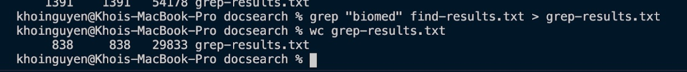
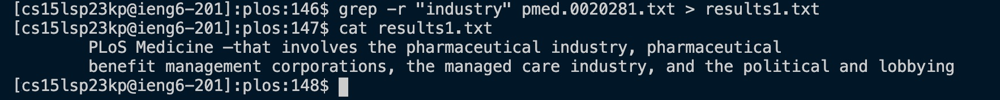
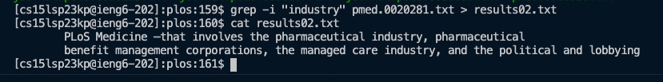
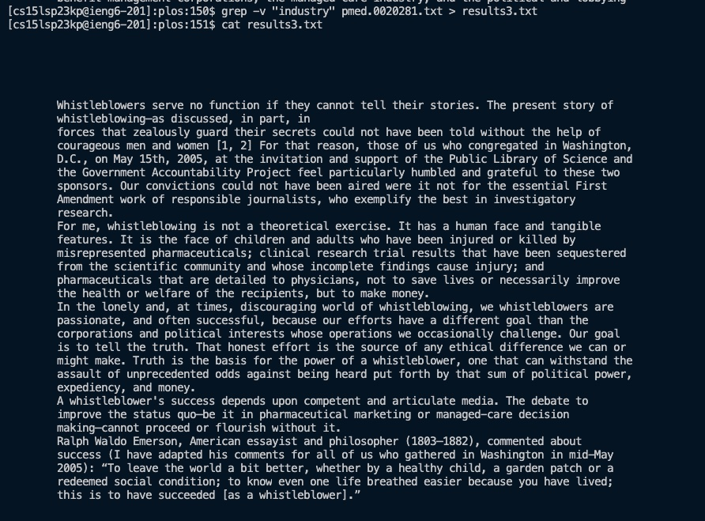
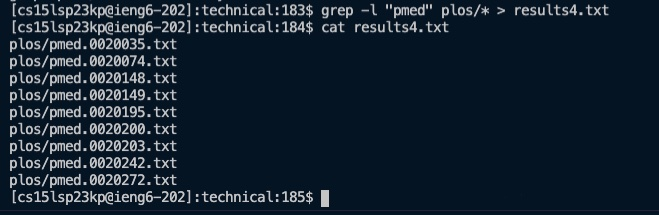

# Khoi Nguyen - Lab 3
### Research Commands
In this lab, I will be discussing the `grep` command and four command-line options or alternates to the `grep` command. <br>
To start, we must define what the `grep` command is and its functionality. `grep` is a command for performing filter and search operation in a file or a folder or in the output of another command. <br>

The syntax of `grep` is given by the following: <br>
```
grep [options] pattern [files]
```
<br>
To better visualize, the following image is a screenshot of the syntax of `grep` command syntax. <br>
 <br>
In this screenshot, we see that `grep` is filtering out all files that contains "biomed" in it. Then it is saving all the outputs into the "grep-results.txt". Afterwards, we use the `wc` command to print out the line count, word count, and character count of our saved outputs in "grep-results.txt". <br>
<br>
**Four Alternatives to `grep`** <br>
1) *`-r` command* <br>
`-r` (or --recursive): This option tells grep to search for the specified string in all files within the specified directory and its subdirectories. This is useful when you need to search for a string in a large number of files within a directory tree. <br>
The following is the syntax for `-r` command: <br>
```
grep -r [specified string] [file]
```
The following image is a sample of it's application using it on files and directories from ./technical. <br>
 <br>
Here we searched for the specificed string of "industry" in ```technical/plos``` where the ```pmed.0020281.txt``` is located. The string is searched in that file then it's output is saved to ```results1.txt```. Afterwards, its contents are concatinated using ```cat``` command. <br>
<br>
2) *`-i` command* <br>
`-i` (or --ignore-case): This option tells grep to ignore the case of the search string. This means that if you search for a string with uppercase letters, it will also match any occurrences of that string with lowercase letters, and vice versa. This is useful when you need to search for a string but are not sure whether it is in uppercase or lowercase. <br>
The following is the syntax for `-i` command: <br>
```
grep -i [specified string] [file]
```
The following image is a sample of it's application using it on files and directories from ./technical. <br>
 <br>
Here we searched for the specificied string of "industry"  in ```technical/plos``` where the ```pmed.0020281.txt``` is located. 
Note that its output is the same as the output for the `-r` command since they are doing similar tasks of search and retrieving a specificed string. The only difference is it is not case sensitive. The output is saved to ```results02.txt```. Afterwards, its contents are concatinated using ```cat``` command . <br>
<br>
3) *`-v` command* <br>
`-v` (or --invert-match): This option tells grep to print all lines that do not contain the specified string. This is useful when you need to find all lines that do not match a certain pattern. <br>
The following is the syntax for `-v` command: <br>
```
grep -v [specified string] [file]
```
The following image is a sample of it's application using it on files and directories from ./technical. <br>
 <br>
Here we searched for the specificied string of "industry"  in ```technical/plos``` where the ```pmed.0020281.txt``` is located. The `-v` command then search through the file and prints all the lines that do not contain the specificed string "industry". The output is saved to ```results3.txt```. Afterwards, its contents are concatinated using ```cat``` command . <br>
<br>
4) *`-l` command* <br>
`-l` (or --files-with-matches): This option tells grep to print only the filenames of the files that contain the specified string, not the lines themselves. This is useful when you need to quickly find all files that contain a certain pattern. <br>
The following is the syntax for `-l` command: <br>
```
grep -l [specified string] [file]
```
The following image is a sample of it's application using it on files and directories from ./technical. <br>
 <br>
Here we searched for the specificied string of "pmed" in the entire directory of ```technical/plos```. The `-l` command then search through the entire directory and prints all the filenames that contains the specificed string "pmed". The output is saved to ```results4.txt```. Afterwards, its contents are concatinated using ```cat``` command . <br>
<br>
**NOTE:** Here is the link to where I found these commands -> [grep(1) - Linux man page](https://linux.die.net/man/1/grep)
